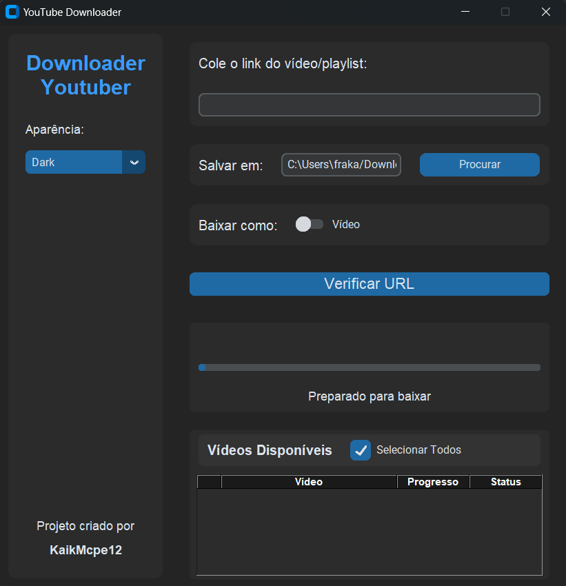

# Nome do projeto




> Software de download de video do youtube em formato MP4 ou MP3.

## 💻 Pré-requisitos

Antes de começar, verifique se você atendeu aos seguintes requisitos:

- Você instalou a versão mais recente de `python`
- Você tem instalado o `ffmpeg`. (Download via `chocolatey`: <a href='https://community.chocolatey.org/packages/ffmpeg' title='download ffmpeg'>clique aqui</a>)

## 🚀 Instalando Downloader Youtuber

Para instalar o Downloader Youtuber, siga estas etapas:

1. Clone o repositório: 
```
git clone https://github.com/KaikMcpe12/download_video-youtuber.git
```

2. Baixe as dependências necessárias, digitando no terminal

```
pip install -r requirements.txt
```

## ☕ Usando <nome_do_projeto>

Para usar Downloader Youtuber, siga estas etapas:

1. Execute o seguinte comando na raiz do projeto

```
python interface/app.py
```

Para testar a aplicação cole a seguinte URL no campo superior e clique no botão verificar URL e clique no botão baixar selecionado. 

Você pode modificar o quanto quiser, mudando o caminho que será baixado, adicionando uma playlist para baixar por completo, escolhendo o download em MP3 OU MP4, selecionando video especifícos de uma playlist

## 🤝 Colaboradores

Agradecemos às seguintes pessoas que contribuíram para este projeto:

<table>
  <tr>
    <td align="center">
      <a href="#" title="defina o título do link">
        <br>
        <sub>
          <b>KaikMcpe12</b>
        </sub>
      </a>
    </td>
  </tr>
</table>

## 📝 Licença

Esse projeto está sob licença MIT.